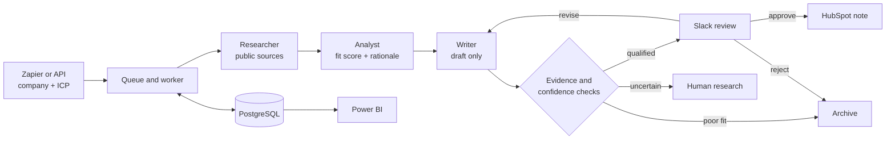

<div align="center">

# AI Account Intelligence

### Human-approved company research, qualification, and outreach operations

**Research -> qualify -> draft -> review -> CRM -> report**

[](https://github.com/Zey-Z/account-intel-outreach/actions/workflows/ci.yml)


[Live health check](https://account-intel-outreach.onrender.com/health) |
[Executive brief](docs/AI_Account_Intelligence_Brief.pdf) |
[Power BI dashboard](powerbi/AI_Account_Intelligence_Dashboard.pbix) |
[Verified deployment](docs/LIVE_VERIFICATION.md)

</div>

---

## The Business Problem

B2B teams often spend hours researching target accounts, comparing them with an
ideal customer profile, writing a first message, and copying the result into a
CRM. The work matters, but much of the process is repetitive and difficult to
audit.

AI Account Intelligence turns that manual loop into a controlled workflow. A
three-agent CrewAI team researches public company information, explains account
fit, and prepares a source-grounded outreach draft. The system keeps the final
decision with a person in Slack and syncs only approved work to HubSpot.

> Think of it as an AI research desk with a human approval counter, not an
> unsupervised sales bot.

## One Run, End to End



| Step | What happens | Why it matters |
|---|---|---|
| 1. Trigger | Zapier or `POST /runs` submits a company and ICP profile. | Business users do not need to run Python manually. |
| 2. Research | Tavily finds public sources; the Researcher stores claims with URLs. | Every accepted fact has evidence. |
| 3. Qualify | The Analyst scores fit and explains pain points, buying signals, and risks. | A score is useful only when a person can understand the reasoning. |
| 4. Draft | The Writer creates a personalized draft from approved evidence. | The model cannot quietly invent a new company fact. |
| 5. Review | Slack provides Approve, Reject, and Request changes actions. | Human judgment remains the final gate. |
| 6. Operate | Approved work becomes a HubSpot note; PostgreSQL and Power BI retain the history. | Teams get an auditable process instead of a one-off AI answer. |

## What Makes This More Than a Prompt Demo

| Design choice | Plain-English meaning |
|---|---|
| **Agents do the thinking; the harness controls the system.** | CrewAI produces research, analysis, and writing. Python code owns validation, database writes, retries, and status changes. |
| **Evidence travels with every claim.** | Research findings keep the source URL, source type, retrieval time, and grounding result. |
| **The workflow knows when to stop.** | Low-confidence, weakly grounded, or uncertain cases move to human research instead of pretending to be complete. |
| **Every important action leaves a record.** | Run events capture state changes, failures, retries, latency, and CRM sync results. |
| **The same system can serve different markets.** | ICP profiles are configuration, so the crew can evaluate healthcare, logistics, education, or AI-workflow accounts without rewriting the application. |
| **Tests do not depend on paid APIs.** | Deterministic offline mode keeps CI fast and repeatable; live mode switches to CrewAI and Tavily for deployed runs. |

## Verified Result

The hosted portfolio deployment has been exercised from intake through human
approval and CRM sync.

| Verification | Observed result |
|---|---|
| Automated quality gate | **82 tests**, Ruff lint, and a Docker image build passed before merge. |
| Live runtime | Render reported **CrewAI + Tavily** with Neon PostgreSQL connected. |
| Account smoke test | Oscar Health produced **5 grounded findings** and a **65 fit score**. |
| Human review | Slack recorded the approval and removed the decision buttons. |
| CRM handoff | HubSpot created an associated company note after approval. |
| Reporting | The deployed dashboard view returned **15 portfolio test runs** to Power BI. |

Detailed request IDs, run IDs, workflow links, and deployment evidence are in
[docs/LIVE_VERIFICATION.md](docs/LIVE_VERIFICATION.md).

## System Architecture

| Layer | Technology | Responsibility |
|---|---|---|
| Business entry | Zapier Tables + Webhooks | Starts a run from a low-code workflow. |
| Service | FastAPI on Render | Accepts requests, exposes status, and handles integrations. |
| Execution | Database-backed worker | Claims queued work once and runs long tasks outside the request. |
| Agent runtime | CrewAI | Coordinates Researcher, Analyst, and Writer tasks. |
| Research | Tavily Search + Extract | Retrieves current public company evidence. |
| Control harness | Python + Pydantic validation | Enforces schemas, grounding, confidence, and lifecycle rules. |
| System of record | Neon PostgreSQL | Stores runs, companies, findings, analysis, drafts, and events. |
| Human review | Slack Block Kit | Captures approve, reject, and revision decisions. |
| CRM | HubSpot private app | Stores approved drafts as company-associated notes. |
| Reporting | PostgreSQL views + Power BI | Shows quality, status, failure, cost, and latency signals. |
| Delivery | GitHub Actions + Docker | Gates merges and Render deployment with tests and a real image build. |

## Run It Locally

The default local path uses deterministic agents and offline research fixtures.
It requires no LLM key and makes the full workflow easy to inspect.

```powershell
python -m venv .venv
.\.venv\Scripts\Activate.ps1
pip install -r requirements.txt

$env:PYTHONPATH="$PWD\src"
$env:AGENT_RUNTIME="deterministic"
$env:RESEARCH_MODE="offline"
$env:DATABASE_URL="sqlite:///data/account_intel.db"

python scripts\init_db.py
python scripts\create_sample_run.py
python scripts\run_worker.py
python scripts\show_latest_run.py
```

Start the API:

```powershell
uvicorn main:app --reload
```

Then open `http://127.0.0.1:8000/health` or the generated FastAPI docs at
`http://127.0.0.1:8000/docs`.

Run the quality gate locally:

```powershell
python -m ruff check .
python -m unittest discover -s tests -v
docker build -t account-intel-outreach .
```

For live agents, copy `.env.example` to `.env`, add the required credentials,
and switch `AGENT_RUNTIME=crewai` and `RESEARCH_MODE=tavily`. The complete setup
sequence is documented in [docs/EXTERNAL_SETUP.md](docs/EXTERNAL_SETUP.md).

## API at a Glance

| Endpoint | Purpose |
|---|---|
| `POST /runs` | Create a queued account-intelligence run. |
| `GET /runs/{run_id}` | Read current status, outputs, and event history. |
| `POST /runs/{run_id}/retry` | Requeue an eligible failed run. |
| `POST /worker/process-next` | Claim and process the next queued run. |
| `POST /slack/interactions` | Receive signed Slack review decisions. |
| `POST /crm/sync-approved` | Idempotently sync approved drafts to HubSpot. |
| `GET /reports/{view_name}.csv` | Export a controlled reporting view for Power BI. |
| `GET /health/deep` | Check service and database health with request tracing. |

Protected endpoints require `X-API-Key`. Slack requests are independently
verified with the app signing secret.

## Repository Guide

```text
src/account_intel/   agents, harness, validation, database, and integrations
tests/               offline unit and boundary tests
migrations/          versioned PostgreSQL schema changes
eval/                repeatable account-quality evaluation
knowledge_base/      approved messaging and ICP guidance
powerbi/             dashboard artifact and refresh contract
scripts/             setup, worker, reporting, and export commands
docs/                project story, deployment evidence, and learning notes
```

## Project Documents

| Document | Best for |
|---|---|
| [Executive brief](docs/AI_Account_Intelligence_Brief.pdf) | A one-page business case and verified outcome. |
| [Project story](docs/AI_Account_Intelligence_Project_Story.pdf) | A two-page narrative of the problem, design decisions, delivery, and result. |
| [Live verification](docs/LIVE_VERIFICATION.md) | Evidence that the deployed workflow was exercised. |
| [Production readiness](docs/PRODUCTION_READINESS.md) | CI/CD, migrations, health checks, logging, rate limits, and operating model. |
| [Power BI guide](powerbi/README.md) | Dashboard purpose, refresh contract, data model, and verification checklist. |
| [Classroom walkthrough](docs/CLASSROOM_WALKTHROUGH.md) | A beginner-friendly tour of the completed system and why each layer exists. |
| [Project log](docs/PROJECT_LOG.md) | The append-only engineering decision record; read the current snapshot first. |

---

<div align="center">

Built as an end-to-end applied AI systems portfolio project using public company
information and human-approved business actions.

</div>
